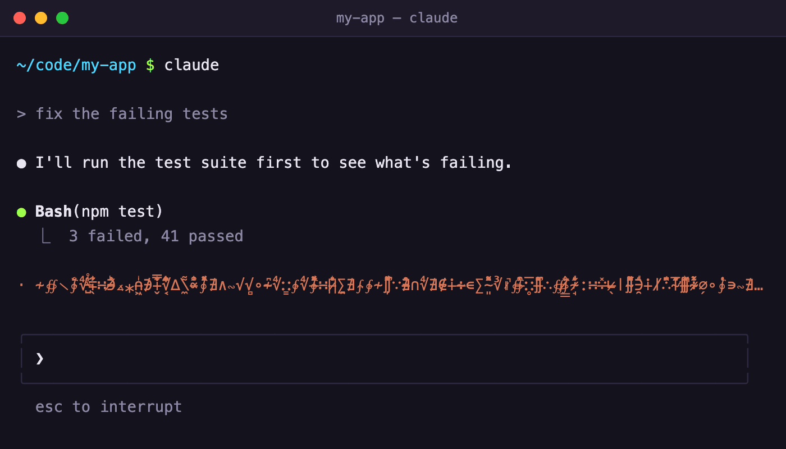

# Spinnerz

Broken, glitched spinner text for Claude Code. No words. **[Project website](https://spinnerz.evan-roth.com)**



While Claude Code works, it shows a word next to the spinner: *Jogging…*, *Pondering…*. This swaps those words for 200 lines of corrupted noise: stacked zalgo marks, dripping box-drawing, runes, mojibake, error debris, emoji, flags that don't exist.

Each line was bred, not written. A gallery of about 30 glitch effects mixed and mutated them, and Evan rated them by hand over a few rounds. The ones he kept were frozen into the plain text Claude Code can show, each long enough to fill an 80-column terminal. Claude adds its own spinning glyph and shimmer.

## Install

Paste this into Terminal:

```sh
curl -fsSL https://raw.githubusercontent.com/evanroth/glitch-spinners/main/install.sh | bash
```

Then start a new Claude Code session. Sessions that are already running keep their old words until you restart them.

The installer backs up `~/.claude/settings.json` (to `settings.json.backup-<date>`), then adds the strings to it. Your other settings stay as they are. It needs [`jq`](https://jqlang.org/), which comes with recent versions of macOS. On Linux: `sudo apt install jq`, or your package manager's equivalent.

### Mix with Claude's own words

By default you get only these. To add them to Claude's usual words instead:

```sh
curl -fsSL https://raw.githubusercontent.com/evanroth/glitch-spinners/main/install.sh | bash -s -- --append
```

## Update

Run the install command again. It replaces the list with the latest one.

## Uninstall

```sh
curl -fsSL https://raw.githubusercontent.com/evanroth/glitch-spinners/main/uninstall.sh | bash
```

This removes the `spinnerVerbs` setting (after another backup), and Claude goes back to its default words.

## Notes

- Running the installer replaces any `spinnerVerbs` you already had, and uninstalling removes it. Both keep a backup.
- If you set `CLAUDE_CONFIG_DIR`, the scripts use the `settings.json` in that folder.
- Claude Code has one spinner word list, so this replaces any other one you've installed, such as [36 Spinners](https://36-spinners.evan-roth.com).
- How a line looks depends on your terminal and font: how tall the stacked marks get, how wide the emoji are, which symbols have glyphs.

## Breed your own

The galleries that made these are in `gallery/` (Python 3.9+, standard library only, macOS/Linux terminals).

```sh
python3 gallery/glitch_gallery.py   # every effect, animated, with color and motion
python3 gallery/claude_gallery.py   # only what Claude Code can really show
```

**Warning: `glitch_gallery.py` flashes and strobes.** Press `s` there for calm mode.

`glitch_gallery.py` shows about 30 effect families (zalgo, math alphabets, lookalike letters, rot, decode, tear, drip, smear, mojibake, hex leaks, error debris, enclosing marks, regional indicators, invisible characters…) stacked and animated on noise. Some only change characters, and those survive as real spinner text. Others need color or motion, which a spinner string can't carry.

`claude_gallery.py` freezes each entry into the plain strings it would install, draws them with Claude's own glyph and shimmer, and grows each one to fill the line. It works in rounds: like what you want to keep, then `--next-round` breeds a new round from your likes.

| Key | |
|---|---|
| `space` / `x` | like / nope |
| `m` | 6 mutations of the current entry, added below it |
| `L` | breed 8 new entries from everything you liked |
| `n` | 8 new combos |
| `enter` | focus view |
| `o` | filter: all / liked / hide noped |
| `r` | (Claude preview) next wait: each row shows another of its strings |
| `<` `>` | (Claude preview) shorter / longer lines |
| `e` | export liked entries to `spinner-verbs.json` |
| `?` | all keys |

Then try them: `./install.sh` (from the clone, it uses your local `spinner-verbs.json`), and `./uninstall.sh` to go back.

To rebuild this project's list and website from a round: `python3 tools/build.py` writes `spinner-verbs.json` and `docs/entries.js`, and `python3 tools/make_gif.py` redraws the GIF (needs Google Chrome, ffmpeg and Pillow).

## License

Public domain ([CC0](LICENSE)). Do whatever you like with it.
